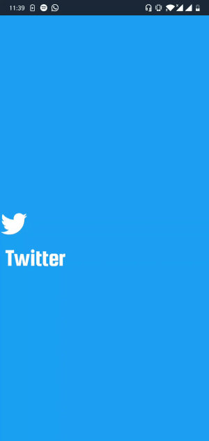

Motion Layout Playground
-----------------------------
This is a demo project demonstrating how to use motion layout

# Development Environment
Android Studio 3.4 is required and may be downloaded
[here](https://developer.android.com/studio/archive).

## Splash Screen Demo

## Twitter Profile UI

